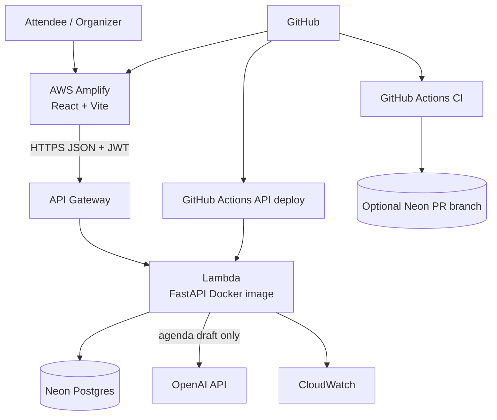

# Architecture

```mermaid
flowchart TB
    User[Attendee / Organizer] --> Amplify[AWS Amplify\nReact + Vite]
    Amplify -->|HTTPS JSON + JWT| Gateway[API Gateway]
    Gateway --> Lambda[Lambda\nFastAPI Docker image]
    Lambda --> Neon[(Neon Postgres)]
    Lambda -->|agenda draft only| OpenAI[OpenAI API]
    Lambda --> CloudWatch[CloudWatch]
    GitHub[GitHub] --> CI[GitHub Actions CI]
    GitHub --> Deploy[GitHub Actions API deploy]
    CI --> Preview[(Optional Neon PR branch)]
    Deploy --> Lambda
    GitHub --> Amplify
```

OpenAI is an optional server-side integration. The browser never receives the OpenAI API key.
