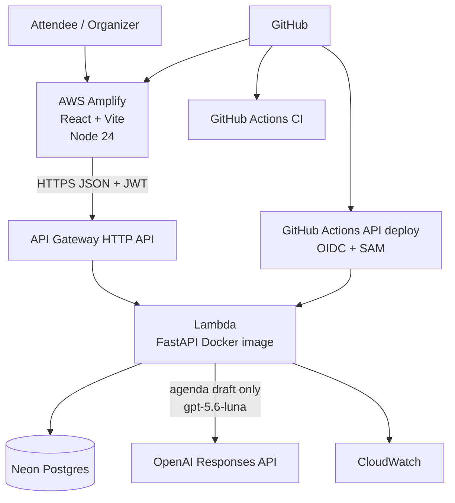

# Architecture

## Notes

- OpenAI is an optional server-side integration. The browser never receives the OpenAI API key.
- CORS allows local Vite (`http://localhost:5173`) and Amplify default hosts (`https://*.amplifyapp.com`).
- Neon database branching for pull-request previews is **not implemented**; production/dev share the configured `DATABASE_URL` secret.
- Deployed API region is `ap-southeast-1`. Live URLs stay in the README.
- Lambda entry is Mangum wrapping FastAPI with `lifespan="off"` (`backend/app/lambda_handler.py`). Local Compose runs uvicorn directly.
- The API issues its own JWTs (`POST /auth/register`, `POST /auth/token`): HS256, 8-hour expiry, secret `JWT_SECRET`. There is no Cognito or other identity provider. The browser stores the bearer token in `localStorage`. Create, RSVP, and agenda routes require that token.
- Compose and local uvicorn read `DATABASE_URL`. SQLite (`sqlite:///./meetup_planner.db`) is the local shortcut; Neon is for deployed environments. Tables are created with `Base.metadata.create_all` at import time.
