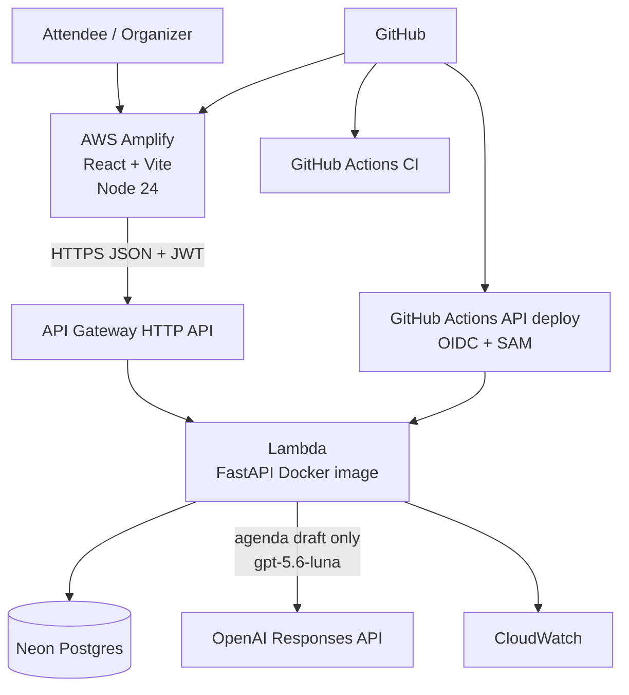

# Architecture

## Notes

- OpenAI is an optional server-side integration. The browser never receives the OpenAI API key.
- CORS allows local Vite (`http://localhost:5173`) and Amplify default hosts (`https://*.amplifyapp.com`).
- Neon database branching for pull-request previews is **not implemented**; production/dev share the configured `DATABASE_URL` secret.
- Frontend auth uses bearer JWTs stored in the browser; create/RSVP/agenda routes require that token.
